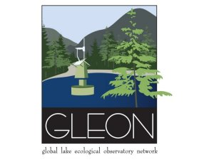

# How To Build A Model In R
GLEON All Hands' Meeting 2022<br />
<a href="url"></a>
-----

:busts_in_silhouette: Robert Ladwig, Hilary Dugan and Paul Hanson<br />
:clock1: Oct 30th, 13:30-16:30 Boyd Center Conference Room <br />
:speech_balloon:2.5 - 3 hours <br />
:computer: Please install the packages **tidyverse** and **reshape** before the workshop
-----

<br />


*Disclaimer: This is not the final material, please check again later.

Want to be a modeler but don't know where to start? Do you find the word "model" scary? Wish you knew more about how to get started building models in R? If yes to any of the above, this workshop is for you. If you already have some R basics under your belt, we aim to add modeling to your R skillset. Learn what models are and how models are built, calibrated, and used for simplifying data and prediction.

### Installation
You can clone or download files from this [Github repository](https://github.com/LimnoDataScience/HowToBuildAModelInR) (click the green "Code" button and select the "Clone" or "Download ZIP" option).
  You’ll need R (version >= 3.5), a GUI of your choice (e.g., Rstudio) and these packages:
  ```
  install.packages("tidyverse")
  install.packages("pracma2")
  ```

## Part 1: Ordinary least squares (OLS) - estimating parameters in a linear regression model (timeless)
Lead: Hilary Dugan<br />
Walkthrough of R code for estimating the parameters in a linear regression model using ordinary least squares. Parameters are derived both from formulas and optimization the sum of squared estimate of errors.

Learning goals: 
- What is a model? 
- Analytical vs numerical solutions
- What is a parameter? 
- Fitting parameters and optimization
- optim

## Part 2: Starting from scratch with a dynamic mass balance metabolism model (~62 min)
Lead: Paul Hanson <br />
A brief introduction to process-based time dynamic models is followed by a walkthrough of an R code example of lake metabolism and oxygen dynamics. Example code will be available for participants to play along.

Learning goals: 
- What is a dynamical model? 
- Why metabolism?
- Coding a simple example 
- Exploring lake system behavior

## Part 3: 1D transport (~ ½ hour)
Lead: Robert Ladwig <br />
Fancy coding a one-dimensional diffusion model? We will code up the diffusion algorithm from theory using for-loops in R. Then we will play around with the model to see how parameter changes result in alternative transport scenarios. 

Learning goals:
- Understanding the one-dimensional diffusion equation
- How can we discretize the equation?
- How to code up the diffusion model in R and visualize the output
- Understanding model assumptions and uncertainties

